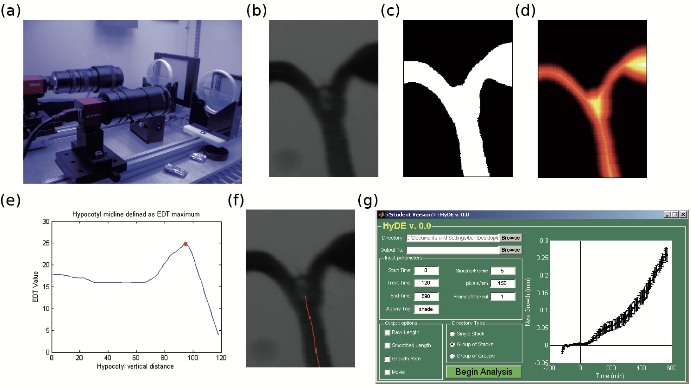

# chorylab-HyDE

This is the official repo for HyDE (Hypocotyl Determining Engine), a hardware and software pipeline that measures hypocotyl growth in time-series images. Developed by Benjamin J. Cole, 2011. Documentation organized here by Russell Tran, 2021.  

2011 documentation:

- [*Automated analysis of hypocotyl growth dynamics during shade avoidance in Arabidopsis*](https://doi.org/10.1111/j.1365-313X.2010.04476.x)
- [*Rapid and dynamic growth of Arabidopsis seedlings in response to changes in light
quality: A live imaging study*](https://escholarship.org/content/qt8j3081vb/qt8j3081vb_noSplash_5ff25572facd6a6b99431395aba48c39.pdf?t=n701fs)
- `doc/hyde_userguide.pdf` in this repo. Excerpted from the Appendix of Benjamin's above thesis.

*Figure S1. Image acquisition apparatus and image analysis software. (a) Two CCD cameras were set up to image plates, half‐covered in growth media, under LED light conditions. (b) Whole images were cropped such that a single seedlings is visible, where the hypocotyl is the only structure present at the bottom. (c) The raw image is converted into binary format, and then the EDT is calculated (d). (e) A graph is constructed based on the value of the EDT at every hypocotyl midpoint along the vertical axis [rotated (d) 90° to the right], and a local maximum is selected indicating the centroid of the shoot apical meristem (red dot). (f) A line is drawn on the hypocotyl for every image in the stack for verification. (g) GUI for HYDE, illustrating the various features and parameters of the software.*

# Releases

## 2012 Validated Release 

### Known bugs / idiosyncrasies

## 2011 Validated Release

### Known bugs / idiosyncrasies

## Example Image Dataset Release
I cleaned up some of the preexisting example image datasets for your ease of use.

* `stack_example.zip`: based on test images available in 2012 Validated Release
* `group_of_stacks_example.zip`: based on `2011_Col-0_ctrl.zip`
* `group_of_groups_example.zip`: based on `2011_Col-0_ctrl.zip` and `2011_Col-0_shade.zip` 

## [2011 Release](https://github.com/Salk-Harnessing-Plants-Initiative/chorylab-HyDE/releases/tag/v1.0.0)
Dump of all available files from 2011

	* `2011_HyDEv1_0_win32.zip`: Contains distrib of HyDE v1.0, which is the most stable version of HyDE and the published version used in the paper. Needs MCR 7.14.
	* `2011_Col-0_ctrl.zip`: Example image data set ready for input into HyDE. Arabidopsis Col-0 grown as control. Contains .avi videos as well.
	* `2011_Col-0_shade.zip`: Example image data set ready for input into HyDe. Arabidopsis Col-0 grown in shade.
	* `2011_Col-0_shade_avi.zip`: Companion to `2011_Col-0_shade.zip`; the .avi videos are kept here.
	* `2011_jekell_files.zip`: Contains
		* `jekell_preprocess.java`: source for FIJI Plugin to preprocess camera images before input to HyDE
		* `Interop.Galil.0.5.dll`: useful for interfacing with the carousel
		* `jekell_3.exe`: a binary used to run the carousel (the source no longer exists). Both `jekell_3.exe` and the carousel are a prototype.
		* `jekell_preprocess.class`: a binary used in for preprocessing
	* `2011_HyDE_versions.zip`: Contains 
		* Source of HyDE v1.0 
		* A binary for the work-in-progress HyDE v2.0 
		* The source for the work-in-progress HyDE v4.0. 
		* There is no HyDE v3.0. HyDE v2.0 and 4.0 amorphously have some work to incorporate leaf angle and different methods to compute Shoot Apical Meristem (SAM), per Benjamin's memory. Consider this zip bundle only for exploratory purposes.

# Development
The source included in this repo is based on the 2011 published HyDE v1.0, and the preprocessing FIJI plugin (referred to as Jekell). For exploration of other old work, look at the [2011 Release](https://github.com/Salk-Harnessing-Plants-Initiative/chorylab-HyDE/releases/tag/v1.0.0).

We only had the 2011 source for v1.0 and v4.0. If you want to see what Benjamin changed, you can view the diff of [commit 458e699](https://github.com/Salk-Harnessing-Plants-Initiative/chorylab-HyDE/commit/458e699259ccee7ba7d7a892298637f221d05c95) from the archival branch `2011-hyde-v4`. 

# Russell's guide
The pipeline is as follows: Images acquired as "stacks" from camera -> preprocessing manually or using ImageJ script -> input into HyDE using GUI -> automated measurements and/or video

## Hardware

* Windows 10 computer with Firewire (6-pin or 9-pin) port, or a USB-C port
* Allied Vision Camera: Marlin

TODO: expand if works
* Camera requires 6-pin Firewire cable. Firewire ports were phased out of most computers around 2010. You can daisy chain to USB-C using a 6-pin to 9-pin cable and a 9-pin to USB-C adapter. Example:
	- [Pasow FireWire 800 to 400 9 to 6 pin Cable (9pin 6pin) 6FT, IEEE 1394 Firewire 800 9-pin/6-pin Cable 6 Feet(9 pin to 6 pin)](https://www.amazon.com/gp/product/B00X65XHZG/ref=ppx_yo_dt_b_asin_title_o01_s00?ie=UTF8&psc=1). 9-pin is backwards compatible with 6-pin.
	- [Apple Thunderbolt to FireWire Adapter](https://www.amazon.com/gp/product/B00SQ2CJUS/ref=ppx_yo_dt_b_asin_title_o01_s01?ie=UTF8&psc=1). Thunderbolt is basically USB-C. Adapters usually don't exist from Firewire to normal USB because the data transfer rate is insufficient. 
* Schematic for plate holder, carousel, carousel motor come from Salk Machine Shop.
* TODO: products given by paper
* TODO: Transformer
* TODO: rail

## Software installation

### SmartLink control software for Marlin camera

### 2012 Validated Release for HyDE

## Blog (For Chory Lab use)

### 26 March 2021

### 24 March 2021
Was able to find the rail stage + carousel + small backlight, the Marlin camera, a 6-pin Firewire cable, 1 big backlight, 1 plate holder, 2 7-pin power transformers for the backlights. Backlights are infrared, so need to have camera working to validate whether they are still functional. Noticeably missing were the guppy camera and other plate holders. Desktop computer which used to run the apparatus was dead/could not boot, so sent to IT. Bought Firewire adapters from Amazon to attempt daisy chain to camera:

- [Pasow FireWire 800 to 400 9 to 6 pin Cable (9pin 6pin) 6FT, IEEE 1394 Firewire 800 9-pin/6-pin Cable 6 Feet(9 pin to 6 pin)](https://www.amazon.com/gp/product/B00X65XHZG/ref=ppx_yo_dt_b_asin_title_o01_s00?ie=UTF8&psc=1)
- [Apple Thunderbolt 2 to FireWire Adapter](https://www.amazon.com/gp/product/B00SQ2CJUS/ref=ppx_yo_dt_b_asin_title_o01_s01?ie=UTF8&psc=1)
- [Apple Thunderbolt 2 to Thunderbolt 3 Adapter](https://www.amazon.com/Apple-Thunderbolt-USB-C-Adapter/dp/B01MQ26QIY)

Attempting daisy chain per suggestion from https://www.pro-tools-expert.com/production-expert-1/2019/2/12/is-it-possible-to-get-firewire-400-devices-to-work-with-thunderbolt-3-usb-c-and-breathe-life-back-into-our-old-audio-interfaces and https://www.youtube.com/watch?v=GASIuX1mqwE.

### January 2021
Cactus server (dead and whose hard drives were in RAID setup so order needs to be reconstructed to access) used to host official source and distribution for HyDE, but Benjamin says files and documentation we currently have are the same.

# Appendix

## Software installation for 2011 Validated Release for HyDE

## Alternative method to obtain MCR (Matlab Compiler Runtime) 7.14
You shouldn't need this as MCR is provided in the 2011 and 2012 Validated Releases for HyDE, but suppose you needed a fresh copy of a particular MCR version. For MCR 7.14 (used in 2011 Validated Release),

1. Install [Matlab 2010b](https://www.mathworks.com/downloads/web_downloads/download_release?release=R2010b). You'll need a license/Matlab account to be able to do this. Download the Windows 32-bit version (even if you're on 64-bit, which you likely are if you're using Windows 10). A bunch of packages might be prechecked; uncheck all and just check MATLAB (7.11) and MATLAB Compiler (4.14), then download the files they tell you to.
	* During installation, answer No to the prompt to check for updates.
1. Open Matlab and type `mcrinstaller` in the command window. It will give you the path to an MCRInstaller.exe you can use or bundle with your distribution.

Note you can replace the `release` parameter in https://www.mathworks.com/downloads/web_downloads/download_release?release=R2010b to get different versions of Matlab (which also correspond to different versions of MCR).

## Notes on carousel prototype

